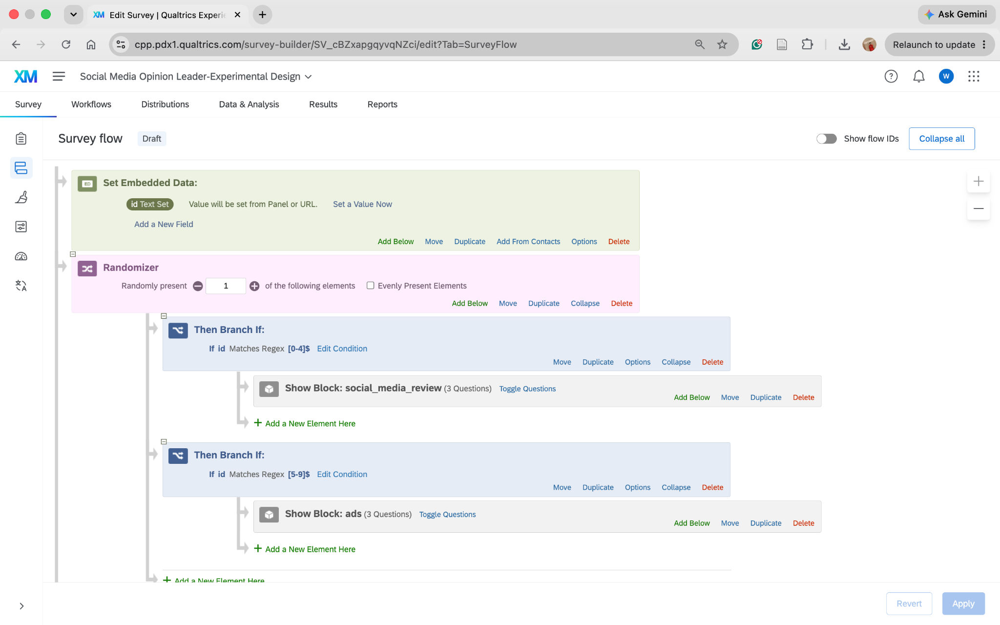
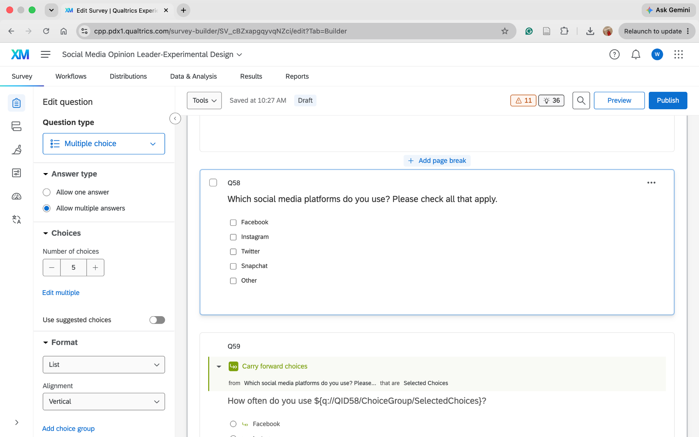
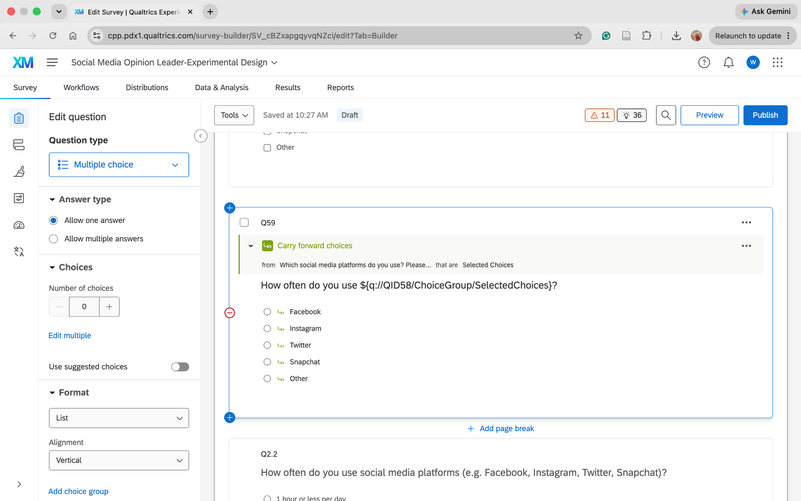
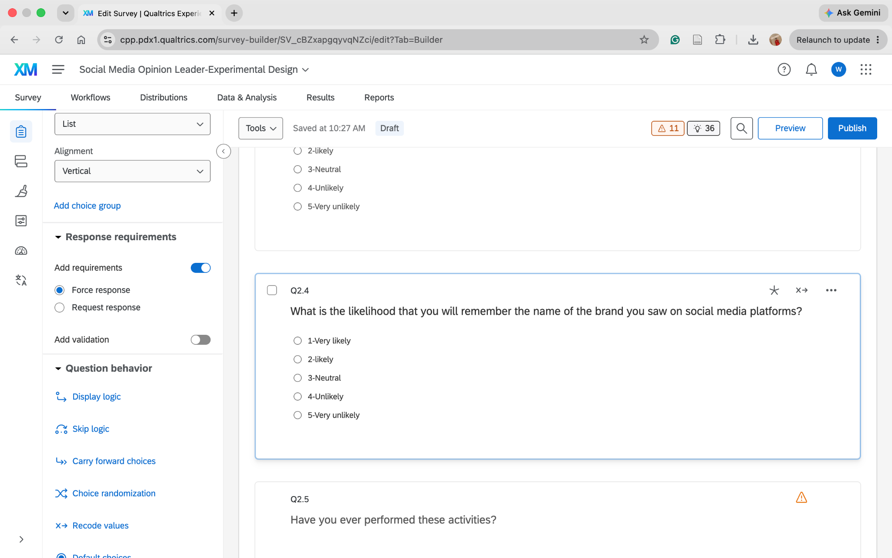
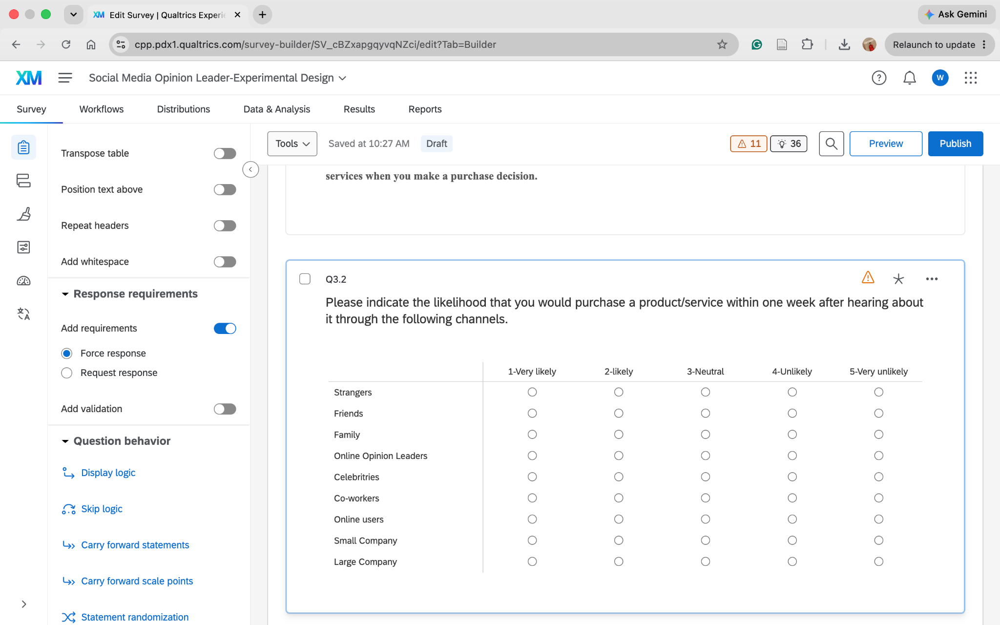
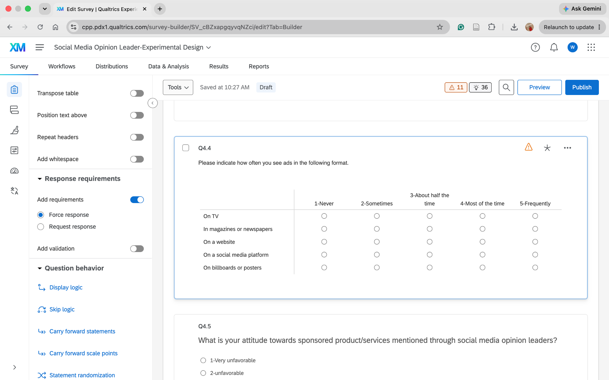

## Survey Flow: Randomization and Branching

The survey flow was modified to randomly assign participants to one of two experimental conditions. An embedded data field named "id" was used with a Randomizer and branching logic to determine whether participants were shown the social_media_review block or the ads block.

## Multiple Answers

Q58 was configured to allow respondents to select multiple social media platforms that they use.

## Carry Forward Choices and Piped Text

Q59 was configured to carry forward the choices selected by respondents in Q58. Piped text was also used to display the selected choices from Q58 in the Q59 question text.

## Additional Improvements

Three additional improvements were made to reduce missing responses for important survey questions.

### Improvement 1: Q2.4 Force Response

Q2.4 was changed to Force Response so that respondents must answer the question before continuing. This improvement helps reduce missing data and ensures that each respondent provides an answer to this important question.

### Improvement 2: Q3.2 Force Response

Q3.2 was changed to Force Response so that respondents must provide a response before continuing. This improvement helps reduce missing data across the matrix items and provides more complete information about respondents’ purchase likelihood across different information sources.

### Improvement 3: Q4.4 Force Response

Q4.4 was changed to Force Response so that respondents must provide a response before continuing. This improvement helps reduce missing data and ensures more information about how frequently respondents encounter advertisements across different formats.

## Appendix

### GitHub Repository

[GitHub Repository](https://github.com/WillySuu/Qualtrics-M02---Setting-up-an-Experimental-Design)

### Published HTML Page

[Published HTML Page](https://willysuu.github.io/Qualtrics-M02---Setting-up-an-Experimental-Design/)